# chromium-screenshots

> **The missing screenshot service for authenticated workflows.**
> *Inject cookies & localStorage. Native MCP Support. Pixel-perfect Chromium.*

[](https://github.com/samestrin/chromium-screenshots/actions/workflows/ci.yml)
[](https://opensource.org/licenses/MIT)
[](https://www.python.org/downloads/)
[](https://hub.docker.com/)

## ⚡ Why this exists

Taking screenshots of modern web apps is broken. Standard tools assume authentication happens via Cookies, but most SPAs (Wasp, Firebase, OpenSaaS) use `localStorage`.

If you try to screenshot your dashboard with a standard tool, you just get a picture of the login page.

**chromium-screenshots** solves this by letting you inject the *entire* browser state—Cookies, LocalStorage, and SessionStorage—before the page loads.

### The "Impossible" Shot


| Feature | Standard Tools | chromium-screenshots |
| :--- | :--- | :--- |
| **Auth Injection** | ❌ Cookies only | ✅ Cookies + LocalStorage + SessionStorage |
| **AI Integration** | ❌ Manual API calls | ✅ Native MCP Server (Claude/Gemini) |
| **Rendering** | ⚠️ Often inconsistent | ✅ Pixel-perfect (Playwright) |
| **SPA Support** | ❌ Fails on hydration | ✅ Waits for selectors/network idle |

## 🤖 Standardized AI Integration

This tool isn't just an API; it's a "visual cortex" for your AI agents. It implements the **Model Context Protocol (MCP)**, allowing tools like Claude Desktop to natively control the browser.

*   **`screenshot`**: Returns base64 data for immediate analysis ("What does this button say?").
*   **`screenshot_to_file`**: Saves to disk to preserve context window tokens ("Save a snapshot of the landing page").

## 🚀 Quick Start

### Docker (Recommended)

Run the containerized service. No dependencies required.

```bash
docker compose up -d
```

> The API is now active at `http://localhost:8000`.

### Python (Local)

```bash
pip install -r requirements.txt
playwright install chromium
uvicorn app.main:app --reload
```

## 💡 Common Recipes

See what's possible with a single request:

```bash
# 1. Simple Full Page Capture
curl "http://localhost:8000/screenshot?url=https://github.com&type=full_page" -o github.png

# 2. The "Impossible" Auth Shot (Wasp/Firebase/SPA)
# Inject the session token into localStorage before capturing
curl -X POST "http://localhost:8000/screenshot" \
  -H "Content-Type: application/json" \
  -d '{
    "url": "https://app.example.com/dashboard",
    "localStorage": {
      "wasp:sessionId": "secret_session_token",
      "theme": "dark"
    },
    "wait_for_selector": ".dashboard-grid"
  }' -o dashboard.png

# 3. High-Quality Marketing Shot
# 2x resolution, JPEG format, dark mode
curl "http://localhost:8000/screenshot?url=https://example.com&width=2560&height=1440&format=jpeg&quality=95&dark=true" -o marketing.jpg

# 4. Check Health (for k8s probes)
curl http://localhost:8000/health
```

## 📚 Documentation

Interactive documentation is available when running locally:

*   **Swagger UI**: `http://localhost:8000/docs`
*   **ReDoc**: `http://localhost:8000/redoc`

## 🧠 How It Works

**The Flow:**
1. You (or Claude) send a request with a URL and optional Auth data.
2. The service spins up a fresh, isolated Chromium context.
3. It injects your `cookies` and `localStorage` *immediately*.
4. It navigates to the page (already authenticated).
5. It captures the pixel-perfect render.

```mermaid
sequenceDiagram
    participant U as 👤 User / Agent
    participant A as ⚡ API / MCP
    participant B as 🕸️ Chromium
    participant S as 💾 Storage

    U->>A: POST /screenshot (url, auth)
    A->>B: Create Context
    
    rect rgb(30, 30, 30)
        note right of B: Deep Injection
        B->>S: Set localStorage items
        B->>S: Set Cookies
    end
    
    B->>B: Navigate to URL
    B->>B: Wait for Load / Selector
    B-->>A: Capture Screenshot (Buffer)
    A-->>U: Return Image (PNG/JPEG)
```



## License

[MIT License](LICENSE)