# chromium-screenshots

> **The missing screenshot service for Vision AI & Auth.**
> *Inject auth. Extract DOM. Zero-drift capture. Pixel-perfect Chromium.*

[](https://github.com/samestrin/chromium-screenshots/actions/workflows/ci.yml)
[](https://opensource.org/licenses/MIT)
[](https://www.python.org/downloads/)
[](https://hub.docker.com/)

## ⚡ Why this exists

Taking screenshots for **Vision AI** is hard. If you take a screenshot and then scrape the HTML separately, the page state drifts. Elements move. Popups appear. Your bounding boxes don't match the pixels.

**chromium-screenshots** guarantees **Zero-Drift**. It extracts the DOM coordinates (ground truth) and the screenshot (pixels) from the exact same render frame.

### Visual Proof


| Feature | Standard Tools | chromium-screenshots |
| :--- | :--- | :--- |
| **Data Extraction** | ❌ Image Only | ✅ Image + DOM + Bounding Boxes |
| **Quality Control** | ❌ None (hope it loaded) | ✅ **Quality Score** (Good/Low/Poor) |
| **Auth Injection** | ❌ Cookies only | ✅ Cookies + LocalStorage + SessionStorage |
| **AI Integration** | ❌ Manual API calls | ✅ Native MCP Server (Claude/Gemini) |
| **SPA Support** | ❌ Fails on hydration | ✅ Waits for selectors/network idle |

## 🤖 Standardized AI Integration

This tool is a "visual cortex" for your AI agents. It implements the **Model Context Protocol (MCP)**, allowing tools like Claude Desktop to natively control the browser.

*   **`screenshot`**: Returns base64 data for immediate analysis ("What does this button say?").
*   **`screenshot_to_file`**: Saves to disk to preserve context window tokens.
*   **`extract_dom`**: Returns text + coordinates for ground-truth verification.

## 🚀 Quick Start

### Docker (Recommended)

Run the containerized service. No dependencies required.

```bash
docker compose up -d
```

> The API is now active at `http://localhost:8000`.

### Python (Local)

```bash
pip install -r requirements.txt
playwright install chromium
uvicorn app.main:app --reload
```

## 💡 Common Recipes

### 1. Vision AI Ground Truth
Capture screenshot + DOM data + Quality Score in one call.

```bash
curl -X POST "http://localhost:8000/screenshot" \
  -H "Content-Type: application/json" \
  -d "{ \
    \"url\": \"https://news.ycombinator.com\", \
    \"extract_dom\": { \
      \"enabled\": true, \
      \"selectors\": [\"span.titleline > a\"], \
      \"max_elements\": 50 \
    } \
  }" -o hn_capture.png
```

### 2. The "Impossible" Auth Shot
Inject `localStorage` to capture authenticated dashboards (Wasp/Firebase).

```bash
curl -X POST "http://localhost:8000/screenshot" \
  -H "Content-Type: application/json" \
  -d "{ \
    \"url\": \"https://app.example.com/dashboard\", \
    \"localStorage\": { \
      \"wasp:sessionId\": \"secret_session_token\", \
      \"theme\": \"dark\" \
    }, \
    \"wait_for_selector\": \".dashboard-grid\" \
  }" -o dashboard.png
```

## 📚 Documentation

Detailed references for core features:

*   **[API Reference](docs/api-reference.md)** - Full endpoint and parameter guide.
*   **[DOM Extraction](docs/dom-extraction.md)** - How to use ground-truth element coordinates.
*   **[Quality Assessment](docs/quality-assessment.md)** - Understanding extraction quality and warnings.
*   **[MCP Server](docs/mcp-server.md)** - Integration with Claude Desktop & AI agents.

## 🧠 How It Works

**The Zero-Drift Flow:**
1. **Inject Auth:** Set `cookies` & `localStorage`.
2. **Navigate:** Load page and wait for `networkidle`.
3. **Freeze:** Pause execution.
4. **Extract:** Scrape DOM positions & Text (JS evaluation).
5. **Audit:** Run Quality Detection engine (count elements, check visibility).
6. **Capture:** Take screenshot.
7. **Return:** Send Image + JSON together.

```mermaid
sequenceDiagram
    participant U as 👤 User / Agent
    participant A as ⚡ API / MCP
    participant B as 🕸️ Chromium
    participant Q as 🔍 Quality Engine

    U->>A: POST /screenshot (extract_dom=true)
    A->>B: Create Context & Inject Auth
    B->>B: Navigate & Wait
    
    rect rgb(30, 30, 30)
        note right of B: Critical Section
        B->>B: Extract DOM (JS)
        B->>Q: Assess Quality
        Q-->>B: Quality: GOOD
        B->>B: Capture Pixels
    end
    
    B-->>A: Result (Image + Metadata)
    A-->>U: Return
```



## License

[MIT License](LICENSE)